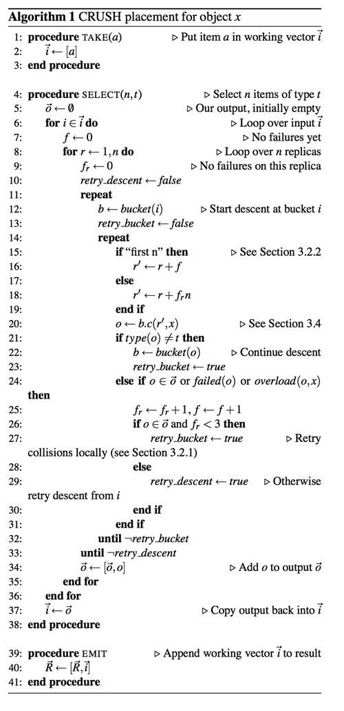
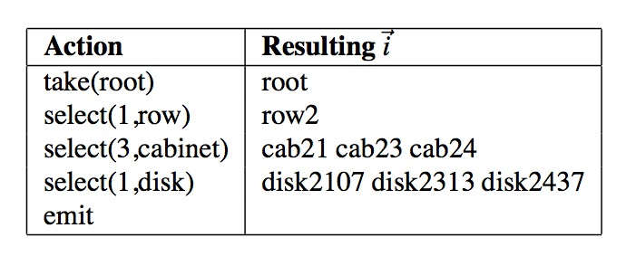
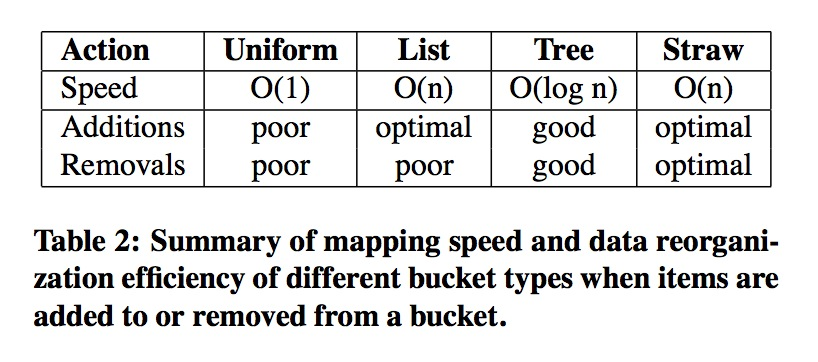
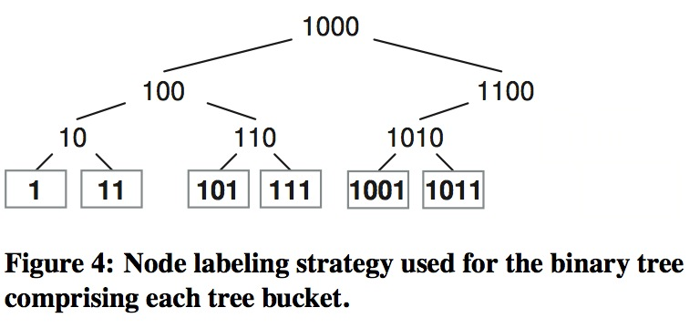

* 目录
{:toc}

# 摘要
新兴的大规模分布式存储系统，是为解决PB级的数据分散的存放在成千上万个存储设备上的问题。类似的系统需要保证系统扩展和管理硬件故障的同时，还要平均的分布数据和负载，从而有效的使用资源和最大化系统性能。我们开发了CRUSH，一个为分布式对象存储系统设计的可扩展伪随机数分布函数，可以不依赖中心目录高效映射数据对象到存储设备上。由于大系统天生的变化特性，CRUSH设计处理添加或移除存储时，尽量最小化不必要的数据移动。这个算法适用于各种数据副本和可靠性机制，也适用于将数据副本分布到不同容错域的用户自定义数据分布策略。

#1 介绍
基于对象的存储是一种可提高可管理性、可扩展性和性能的新兴架构。与传统基于块的磁盘不同，基于对象的存储设备（OSDs，object-based storage devices）内部管理磁盘块分配，对外暴露叫做对象的接口，允许不同大小的读写。在这样的系统中，每个文件的数据被分成较小的对象，分布在整个存储集群中。为了防止故障时导致数据丢失，对象在多个设备上存有副本（或者其它的数据冗余方式）。基于对象的存储系统，通过用小的对象列表替换大的块列表和分散底层块分配问题，简化数据布局（layout）。尽管这样可极大提高可扩展性，减少文件分配的元数据和降低复杂度，但将数据分布到大量不同容量和性能存储设备的基本工作依然存在。
大部分系统只是简单的写入新数据的方式不充分利用设备，这种方式解决的是数据一旦写入就很少移动的问题。存储扩容时，即使完美的分布式系统，也会变得平衡，因为新磁盘要么是空的，要么只包含新数据。大部分情况下，只有新的或老的磁盘处于忙的状态，具体与系统负载有关。
一个健壮的解决方案是将系统的所有数据都随机分布到可用的存储设备上，新老数据混合在一起就有可能平衡分布。当新设备添加时，一部分现有的数据迁移到新存储上回复平衡。这种方式最大的好处就是，所有设备都保持相似的负载，系统处于任何负载时都可以良好的运作。除此之外，在大的存储系统之中，单个的大文件会被随机的分布到多个设备上，可以提供更高的并发度和汇聚带宽。然而，简单的哈希分布在设备数量变化时会有问题，大致大量的数据抖动。现有的副本随机分布方法，在设备出现一致性故障时，有很高的数据丢失风险。
我们开发的CRUSH（Controlled Replication Under Scalable Hashing），一个可以高效健壮的将对象副本分散到异构的结构化存储集群中的伪随机数据分布算法。CRUSH是一个实现的一致性伪随机函数，输入值通常是一个对象或对象组标识符（object group identifier），映射到存放对象副本的设备列表。与传统的实现不同之处在于，数据的位置不依赖于任何类型的文件或对象目录，CRUSH只需要一个简洁的存储设备拓扑结构描述和副本位置策略。这种方式有2个关键优势：首先，是完全分布式，大系统的任何参与部分都可独立计算任何对象的位置；其次，需要的元数据很少且基本固定，仅在设备添加或删除时改变。
CRUSH设计考虑了数据分布充分利用可用资源，存储设备添加删除时高效重组数据，通过灵活的副本位置限制最大化硬件故障或其它意外发生时的数据安全性。支持各种各样的数据安全机制，包括多路复制（镜像）、RAID奇偶校验或其它校验码。这些特性使CRUSH适用于在对扩展性、性能和可靠性都很关键的超大规模（几PB）存储系统中管理对象分布。

#2 相关工作
基于对象的存储作为提高存储系统扩展性的一种方法，最近获得不少关注。很多研究和生产环境的文件系统都使用基于对象的方式，包括开创性的NASD文件系统、Pnasas文件系统、Lustre等。其它基于块的分布式文件系统，如GPFS和FAB也面临类似的数据分布问题。在这些系统中，使用半随机或启发式的方法在可用的存储上分配新数据，但很少重新分配保持分布的平衡。更重要的是，所有这些系统都通过某种元数据目录定位数据，而CRUSH只是依赖于简洁的集群描述和特定的映射函数。在写数据时，系统通过CRUSH可以计算任何新数据的存储位置，而不需要查询中心分配器，这才是最大的区别。Storento存储系统使用的一致性哈希与CRUSH最相似，但缺少平衡数据分布的设备权重和提高数据安全的容错域支持。
尽管数据迁移问题在显示分配映射系统中被大量的研究过，但类似实现都需要大量元数据，而CRUSH没有。Choy在描述数据在磁盘间分布的算法中，在磁盘添加时会移动部分对象，但不支持权重、复制或磁盘删除。Brinkmann用哈希函数分布数据到异构系统中，但只是静态集群。SCADDAR提到了存储添加和删除，但只支持特定的副本策略。他们都没有CRUSH的灵活性和提高可靠性的容错域。

#3 CRUSH算法
CRUSH算法根据每个设备权重值在存储中分布数据对象，尽可能的达到概率统一。分布由表示可用资源和组成的逻辑元素拓扑映射控制。如，一个大规模部署包括很多排服务器机柜，机柜中有硬盘架，硬盘架里有存储设备。数据分布策略在位置规则（*placement rules*）中定义，包括几个目标副本以及副本存放的限制。如，3个镜像副本放在不同物理机柜的设备上，他们使用不同的电源。
给一个整型输入值x，CRUSH输出一个表示n个存储目标的有序列表R。CRUSH使用参数包括x的多整型输入哈希函数，仅使用集群拓扑描述表、位置规则和x让映射完全确定且可计算。分布是伪随机的，从相似的输入得到的输出结果没有明显的关联性。我们称CRUSH产生伪集群（*declustered*）副本分布，输出的这组设备共享数据副本，但彼此又表现出无关联性。

##3.1 集群拓扑映射
集群映射（cluster map）由设备（devices）和桶（buckets）组成，他们都有数字描述符和权重值。桶可以包含任意数量的设备或其它的桶，允许他们在存储拓扑结构中形成内部节点，设备总是叶节点。给存储设备分配权重是为了管理他们需要负责存储的相对数据量。尽管大型系统中包含各种不同容量和性能的设备，数据随机分布时的统计显示设备使用率与负载有关，也就是说设备平均负载与存储的数据量是成比例的。这就产生了一个位置标准，权重，应该由设备容量来。桶的权重定义为它包含的所有项的权重之和。
桶可以由存储拓扑中的任何元素组成，如，在最底层用硬盘架（shelf）桶表示一组相同的硬盘，然后用机柜（cabinet）桶将放在一起的硬盘架组合在一起。机柜还可以再组成排（row）或机房（room）桶，表示整个大系统。通过伪随机哈希函数递归选择嵌套的桶元素，最终决定数据存放的位置。与传统的哈希技术在目标（设备）数量变化时，就会产生大量数据抖动相比，CRUSH基于4个不同的桶类型，每个都对应不同的数据移动算法和计算复杂度。

##3.2 副本位置

CRUSH设计的目的就是要让数据分布在设备上，达到存储利用率和设备带宽资源的平衡。副本在存储拓扑中的位置也会对数据安全性造成极大影响。根据安装时的底层物理架构，CRUSH可以建模，进而定位与设备故障相关的潜在问题源。典型的包括，相近物理设备、共用电源和共享网络。通过将这些信息编码到集群映射表（cluster map）中，CRUSH位置策略可以将对象副本放到不同的容错域中，同时保持需要的分布。如，为了定位并发故障的发生，需要保证数据副本在不同的机架、机柜、电源、控制器或物理位置。
为了适应各种不同的应用场景，包括数据副本策略和底层硬件配置，CRUSH为每个副本策略定义了位置规则，让系统或管理员可以精确指定对象副本的位置。如，为2个副本选择两个存储目标，为3个副本在2个数据中心选择3个存储目标。
算法1的伪代码，在简单的执行环境中，每个规则由一系列应用到的操作组成。

CRUSH函数的输入，x，通常是一个对象的名字或其它描述符，如副本需要放到相同设备上的一组对象的描述符。$$take(a)$$操作选择存储拓扑中的一个元素（通常是桶）然后给它分一个向量$$\vec i$$，它会作为后续操作的输入。$$select(n,t)$$操作遍历每个元素$$i\in\vec i$$,然后在该点的子集中选择n个类型t的离散元素。存储设备都有已知的特定类型，而且系统中的桶包含用于区分不同类型桶的类型字段（如rows和cabinets）。每个$$i\in\vec i$$， $$select(n,t)$$ 迭代调用 $$r \in 1,...,n$$，同时对中间的桶按降序递归，根据$$c(r,x)$$在每个桶中随机选择一个嵌套的元素，找到需要的t类型元素时停止。中间结果$$n|\vec i|$$再放回输入$$\vec i$$，作为后续$$select(n,t)$$的输入，或者$$emit$$操作后放入结果向量。

用个例子进行说明，表1是定义的规则，图1是一个集群拓扑映射图。从拓扑的根部（root）开始，$$select(1,row)$$选择一个row类型的桶（row2），接下来的$$select(3,cabinet)$$选择3个嵌在row2下的机柜（cabinets），分别是(cab21,cab23,cab24)，最后的$$select(1,disk)$$遍历前面的3个机柜得到下面的一个硬盘。最终的的结果是得到同一排不同机柜下的3块硬盘。这种方式可以让副本分散开，但同时限制在某个类型之内，即保证了可靠性，有考虑了性能。规则由多个*take,emit*块组成，允许从不同的存储池获取存储目标，适用于远程复制场景（一个副本存在异地）和分层存储（高速近线存储和大容量慢速磁盘阵列）。

###3.2.1 冲突，故障和过载

为了定位类型$$t$$下的$$n$$个离散元素，$$select(n,t)$$操作需要遍历存储拓扑中的很多层，递归由副本数量$$r = 1,...,n$$决定。在这个过程中，CRUSH可能会重新选择一个修改了的输入$$r'$$，有3种情况：如果一个元素已经在当前组set中（冲突，$$select(n,t)$$结果必须不同）；设备故障（failed）；设备过载（overloaded）。标记故障或过载的设备仍会保留在集群拓扑中，是为了避免不必要的数据迁移。CRUSH会根据集群映射表的信息，主要是报告的过度使用情况，选择性的随机移动一些过载设备的数据。对于故障或过载的设备，CRUSH重新开始$$select(n,t)$$递归过程（见算法1的11行），将元素均匀的分布到整个存储集群。对于冲突的情况，在递归中用替换参数$$r'$$在本地尝试查找，从而远离容易发生冲突的子树，避免数据分布不均。

###3.2.2 复制排名

奇偶校验和纠删码方案与副本方式对位置需求有些不同。在主（primary）拷贝复制方案中，在故障发生时，更希望之前的副本（已经有一个数据拷贝）成为新的主。在类似情形中，CRUSH可以通过重新选择$$r' = r + f$$作为"first n"，其中f是当前$$select(n,t)$$尝试的故障位置次数。奇偶校验和纠删码方案中，因为每个目标存储数据对象的不同位，存储设备在CRUSH输出的排名或位置更重要。特别是存储失败的情况，需要替换其在CRUSH输出的列表$$\vec R$$中相应的位置，这样列表的其它设备的排名保持不变（如图2）。在这种场景下，CRUSH重新选择输入$$r' = r + f_{r}n$$，其中 $$f_{r}$$ 是在r上的失败重试次数，为每个副本排名定义一系列独立故障的候选。与此不同，RUSH没有专门针对故障设备的处理，而是在结果中跳过故障设备，这使得在奇偶校验方案中很难处理。

##3.3 映射改变和数据移动

在大型系统中，添加和删除存储资源的处理是影响数据分布的关键因素。CRUSH为了避免负载和相关的资源使用率不对称，总是保持数据均衡分布。当单个设备故障时，CRUSH对该设备进行标记但仍然留在拓扑结构中，然后根据位置算法（见3.2.1）将其移除（rejected）并重新分布它存储的内容。这样的集群映射改变会产生一定的碎片（最小化）， $$w_{failed}/W$$（W是所有设备总权重），由于故障设备被移除，上面的所有数据都会重新映射到新的存储目标上。
由于有存储资源添加或删除，集群映射结构改变的情况更复杂。CRUSH映射过程使用集群映射作为加权层次决策树，会产生超过理论最优值（$$\phi w \over W$$）外的数据移动。在拓扑的每一层，子树的相对权重改变会影响数据分布，一部分数据对象会从权重下降的子树移到权重增加的子树中。由于拓扑中每个节点的随机位置决策都是完全独立的，数据移入的节点下面是均衡分布的，不需要映射到最终引起权重变化的叶节点。只有位置处理的更深层数据改变，才会引起相应的相对分布。这个影响在表3的二叉树例子中阐述：

拓扑层次的数据移动量有个更低的限度$$\phi w \over W$$，要分布到新加设备上的数据权重是$$\phi w$$。移动数据量随拓扑层次高度h增加，上限是$$h\phi w \over W$$。因为每一步递归要移动到子树的数据对象，被映射到更小相对权重元素上的概率很小，当$$\phi w$$相对于W很小时，数据移动量达到上限。

##3.4 桶类型

一般而言，CRUSH设计是为了调和两个对立的目标：映射算法的效率和扩展性，当添加或删除设备导致集群变化时迁移最少的数据恢复分布平衡。最后，CRUSH定义了4种不同类型的桶来表示内部节点（不是叶节点）：一致桶（uniform）、链表桶（list）、树结构桶（tree）和签桶（straw）。每个桶基于不同的内部数据结构，并在副本定位过程中使用不同的函数$$c(r,x)$$选择内嵌元素，也对应计算与组织效率的不同权衡。通用桶只限于所有权重一致的场景（更像一个通用基于哈希的分布函数），其它类型桶可以包含不同权重的元素。这些桶的区别可参考表2：

###3.4.1 一致桶

在大型系统中设备很少单独添加。新存储通常是部署一些相同的设备，如一个机架或整个机柜。设备达到使用年限时，整体停止使用（排除单个故障），这样很自然的将它们当做一个整体。CRUSH一致桶适用于这种设备都相同的场景。它最大的优势是性能：可以在常量时间内映射副本到桶中。在不满足一致性要求的情况，可以使用其它类型桶。
给CRUSH一个输入值x和副本数r，用函数$$c(r,x) = (hash(x)+rp)$$从大小为m的一致桶中选择一个元素，p是随机选择（但确定）的一个大于m的素数。$$r <= m$$时，通过一些简单的数列定理选择不同的值。$$r > m$$时，两个不同的r与相同的x会定位到同一个元素。实际上，使用位置算法（见3.2.1）的冲突和后续回退发生的概率很小。
如果一致桶大小改变，数据在设备之间完全重组，更像一个通用的哈希分布策略。

###3.4.2 链表桶

链表桶将它的内容组成链表，可以包含任意权重。为了存放一个副本，CRUSH从最近添加元素的链表头开始，对比它与剩余元素权重之和对比。根据$$hash(x, r, item)$$的值，有一定概率选择当前元素，或者继续递归链表。这种方法来源于RUSH$$_{p}$$，重述那个位置问题“最近添加元素，或者更旧的元素”。这是扩展型集群最自然的选择，对象有一定概率重新分到新存储上，也可能继续留在老设备上。当新元素加入到桶里，会产生一定的数据迁移。元素从链表中间或尾部移动会产生大量不必要的移动，所以适合存储不减少后很少减少的场景。
RUSH$$_{p}$$算法与由包含很多一致桶的单链表桶组成的2层CRUSH拓扑相似。用位置规则解决了集群发现过程，CRUSH故障域控制数据存放增强可靠性。

###3.4.3 树结构桶

与其它链表结构相似，运行时间的算法复杂度是线性阶$$O(n)$$，链表桶对小规模元素很有效，但规模变大时可能不适用。树结构桶是RUSH$$_{T}$$的变种，通过将元素保存在二叉树中解决这个问题。将时间复杂度降到对数阶$$O(log n)$$，适合处理更大规模的设备和嵌套桶。RUSH$$_{T}$$与由包含很多一致桶的单个树结构桶组成的两层CRUSH结构相同。
3个桶的结构是一个元素作为叶子节点的权重二叉搜索树。每个内部节点都知道它左右子树的整体权重，并用固定的策略标记。为了在桶中选择一个元素，CRUSH从树根开始，计算输入键值x、副本数r、桶标识符和当前节点标记（初始是跟）的哈希。结果与左右子数的权重比进行比较，然后决定接下来访问哪边的子节点。重复这个过程，直到到达叶子节点，就是要选择的元素。定位一个元素需要计算哈希和比较的次数是$$O(log n)$$。
桶二叉树节点用二进制值标记，这个值生成策略要简单、固定，但要避免树增长或收缩时标签变化。树最左边的叶子永远标记为“1”。树每次扩展时，旧根成为新根的左子树，旧根标签左移一位作为新根的标签（1,10,100等）。树右边的标签在对应左边节点值的前面加一个“1”。图4是一个包含6个叶节点的二叉树。这个策略保证在桶中添加（删除）元素时，查找现有叶节点的路径只在根部增加（删除）额外节点，即位置决策树的开始。一个对象存放的位置确定在某个子树，最终的映射只与子树内的权重和标签相关，只要子树不变映射也不会变。尽管决策树在嵌套元素之间引入了一些额外的数据迁移，但这个策略将数据移动控制在合理范围以内，同时为大规模桶提供了高效的映射。

###3.4.4 签桶

链表和树结构桶结构中，选择元素时还是需要一定次数的哈希计算和权重比较。在做的过程中，采用给特定元素优先权（如表头部分）或忽略部分子树的分治方法处理。可以提高选择副本位置过程的性能，但在添加、删除或调整权重等改变桶内容的情况发生时，会引入欠优组织重组行为。
签桶通过模拟抽签的方式允许所有的元素完全公平的竞争副本位置。确定副本位置时，为桶中的每个元素分一个随机长度的签，签最长的元素胜出。每个签的长度有个固定范围，由CRUSH输入键值x、副本数r和桶元素i的哈希决定。每个签长度会乘以一个根据元素权重得到的因素$$f(w_{i})$$，这样更高权重的元素更有可能在抽签过程中胜出，如$$c(r,x) = max_{i}(f(w_{i}hash(x,r,i)))$$。尽管这个过程要比链表桶慢两倍，甚至比树结构桶还要慢（对数阶增长），但内嵌元素变化时它的数据移动更优。
可以根据集群预期的增长类型，在映射计算和数据移动效率之间进行权衡来决定要选择的桶类型。当桶都比较固定（如相同硬盘的机架），一致桶是最快的。如果桶只是扩展，链表桶将新元素加到表头是优化的数据移动策略，它将尽量多的数据移到新设备上，而其它桶不会有抖动。缺点是，旧元素移出或调整权重时，映射速度是$$O(n)$$，且有额外数据移动。在可能移出和对重组效率敏感的场景下，签桶在子树间的迁移行为有优化。树结构桶是各种场景的中和，提供良好的性能和适合的重组效率。

#4 评价

CRUSH设计基于各种不同目标，包括异构存储设备的权重平衡分布、添加删除设备（包括单个磁盘故障）时最小化数据移动、通过将副本存入不同故障域提高系统可靠性、灵活的集群描述和数据分布规则。通过模拟分配到设备的对象，然后检查分布结果的方式，评价 RUSH$$_{P}$$ 和 RUSH$$_{T}$$ 类型集群类似的CRUSH配置的行为。RUSH$$_{P}$$ 和 RUSH$$_{T}$$ 与由包含很多一致桶的单链表或树结构桶组成的2层CRUSH拓扑相似。尽管RUSH用位置规则解决了集群发现过程，故障域控制数据存放增强可靠性，我们主要考虑数据移动性能。

##4.1 数据分布

CRUSH的数据分布应该看起来是随机的，在相同权重设备上均衡分布，与对象描述符x和存储目标都没有关系。我们用经验方法测量了对象在不同类型桶设备上的分布，并与理论上的均等随机过程的二项式概率分布时磁盘使用对比。当用放每个对象到给定设备i的概率为$$p_{i} = w_{i} \over W$$分布n个对象，根据二项式$$b(n,p)$$的预期设备使用是$$\prop = np$$，标准偏移是$$\sigma = \sqrt{np(1 - p)}$$。在包含很多设备的大系统中，可以近似认为$$1 - p ~= 1$$，标准偏移是$$\sigma = \sqrt{\prop)}$$，当数据对象足够大时使用率最平均。与预期的一致，在同构集群和混合权重设备上，CRUSH分布都与二项式偏差一致。

##4.1.1 过载保护

尽管CRUSH在对象数量很多时可以过得良好的均衡（使用率差别小），但在一些特殊设备上分配的还是比预期的要多，在随机过程中也翻译为非零概率（non-zero probability）。与现有的概率映射算法（包括RUSH）不同，CRUSH包含每个设备的过载修正机制可以重新分布设备上的部分数据。当设备有过度使用的风险时，这个机制可以选择性的稳定过载设备。在1000个设备的集群容量使用超过99%时，尽管在47%的设备上进行过载调整，CRUSH映射执行时间增加不到20%，且方差降低了4倍（与预期的一致）。

##4.1.2 差异性与局部故障

之前的研究表明，实际环境中数据随机分布的系统性能可与仔细做过数据分块的相比（略慢一点）。作为分布式对象存储系统的一部分，在我们自己的CRUSH性能测试中，由于OSD负载（与使用率有关）的差异，随机对象位置会导致大概5%的写性能损失。然而，在实际中，这些差别只与同质的负载相关（通常是写），通过仔细分块策略可以有效解决。更一般的场景，负载是混合的，当它们到达硬盘时已经看起来是随机的（至少与硬盘结构无关），导致设备负载和性能也存在相似的差异（除了仔细布局），同时降低总带宽。
这个分析假设设备容量是固定的。然而，根据实际系统的经验，分布式存储系统经常被少量的慢、过载、碎片化或其它性能差的设备拖累。传统上，显示的分配方法可以人为的避免这些问题设备，而哈希分布函数不能解决问题。CRUSH可以用现有的过载矫正机制将降级（degenetate）设备作为部分故障（partial failure）处理，将一部分数据和负载转移，避免性能瓶颈，并慢慢平衡负载。
如DSPTF算法展示的，通过将读负载分散到不同数据副本，这种存储系统优化负载平衡可以缓和设备负载差异。这种方法虽然是一种补充，但超出了CRUSH映射函数和这篇论文的范围。

##4.2 结构重组数据移动

我们在7290个设备组成的集群上，用CRUSH和RUSH评估了由存储添加和删除引起的数据移动。CRUSH集群有4层：10个存储设备组成一个机架，9个机架组成一个机柜，9个机柜组成一排，共9排。RUSH$$_{P}$$ 和 RUSH$$_{T}$$与由包含729个一致桶（每个桶10个设备）的单链表或树结构桶组成的2层CRUSH拓扑相似。结果与理论上的优化移动数量$$m_{optimal} = \O/ \over W$$对比，$$\O/$$ 是存储设备添加或删除的组合权重，W是系统的总权重。例如系统容量加倍时，在优化的情况下，一半的现有数据需要移动到新设备上。

图5用术语移动因素（movement factor）$$m_{actual} / m_{optimal}$$表示结构重组效率，1表示最优的对象移动，更大的值表示额外的移动。X轴是添加或删除的OSD数量，Y轴是移动因素的对数。在所有情况下，更大权重的变化（相对于整个系统）的重组效率更高。 RUSH$$_{P}$$（一个大链表桶）是一个极端，添加时移动最优但删除时移动最多（性能严重损耗）。CRUSH多层拓扑架构的链表或签桶的移动是第二少。CRUSH的树结构桶略低效，但比RUSH$$_{T}$$好25%（因为树桶里存在不平衡的9项二叉树）。与预测的一致（见3.3），CRUSH链表树在删除的场景中性能差。

图6是内嵌元素添加或删除时的不同类型桶的重组效率。修改树结构桶的移动因素上限是log n，n是二叉树的深度。往签桶或链表桶添加元素差不多是最优的。一致桶中的修改导致所有数据的重排。链表尾部的修改（删除旧数据）也会产生整个桶的数据移动。除了特别限制，链表桶适合与存储很少减少的场景。在大部分重组情况下，一致、链表、树和签桶组合的方式可以最小化数据移动，并保持良好的映射性能。

##4.3 算法性能

计算CRUSH映射算法被设计得尽量快，n个OSDs的集群复杂度是$$O(log n)$$，可以快速定位对象，或集群映射变化时重新选择合适的存储对象。我们通过在上百万个到不同规模集群的映射，与RUSH$$_{P}$$ 和 RUSH$$_{T}$$对比检查CRUSH的性能。图7是映射一组副本到CRUSH集群的平均时间（微秒），CRUSH集群由8项树和一致桶（拓扑深度可变）组成，RUSH集群由固定的两层架构。X轴是系统设备数量的对数，与存储拓扑深度对应。CRUSH性能是相对应设备数量的对数。 RUSH$$_{T}$$由于编码更简单，比CRUSH树结构桶略胜一筹，紧接着是链表和签桶。在测试中RUSH$$_{P}$$线性增长，尽管在实际场景中，根据新部署的磁盘是随着时间指数增长的特性，可以优化实现线性，但32768个设备时花费的时间是CRUSH的25倍。测试使用的是2.8 GHz的奔腾4处理器，所有映射在数十微秒内完成。

CRUSH的效率依赖与存储拓扑深度和使用的桶类型。图8比较了c(r,x)从每种类型桶中选择单个副本需要的时间（Y），X轴是桶的大小。在上层，CRUSH整体按对数阶$$O(log n)$$增加（相对于拓扑深度是线性的），对于特定桶可能是线性阶$$O(n)$$（链表和签桶），不会超过特定的最大值。什么时候在哪里使用特定类型的桶，依赖于可能的添加、删除或权重修改数量。尽管在删除时有额外的数据移动，链表桶比签桶在性能上略有优势。对于规模很大且修改平凡的桶，树桶是个不错的选择，可以减少计算和重组损耗。
CRUSH性能的核心是使用的整型哈希函数，包括执行时间和结果质量。伪随机数通过基于Jenkin的32位哈希mix的多输入整型哈希函数计算。当前的版本，CRUSH映射函数大概有45%的时间花费在哈希值上，哈希值成了提高整体速度和分布质量以及成熟系统的优化目标。

###4.3.1 疏忽老化

因为故障通常是临时的，也为了避免低效的数据重组，CRUSH将故障的设备留在了存储拓扑中。如果忽略了存储系统的老化，设备故障且没有替换的数量就会很多。尽管CRUSH会将数据重新放到正常设备上，由于位置算法更高的回溯概率，还是会有一些性能损耗。我们评估了在1000个设备集群中标记不同比率设备故障时的映射速度。对于一半设备故障这种相对极端的场景，计算映射的时间增加了71%。

##4.4 可靠性

在大规模存储系统中，硬件故障经常发生，数据安全至关重要。像CRUSH这种随机分布策略，分散副本的方式很特别，因为它们与任何设备共享数据扩展伙伴的数量。这有两个相互竞争且对立的影响，第一，在故障之后恢复会并行产生，因为少部分的副本数据。分布到更大规模的对象中，减少恢复时间和额外错误发生的窗口。第二，更大规模伙伴组意味着二次故障丢失共享数据的概率变大。在两路镜像中，大于两个副本的数据安全性在分离时增加。
然而，多故障的关键因素是，不能保证彼此独立，在很多情况下，如断电或物理中断这种单个故障会引发多个设备和更大规模的伙伴分散副本，从而增加数据丢失的风险。CRUSH在用户定义的故障域中分散副本（在RUST或现有的哈希方法中不存在）是为了专门防止这种巧合设计的，从源头修正数据丢失的故障。尽管风险明显减少了，但是在缺少特定存储集群配置和相关历史故障数据的情况下还是很难保证可以显著提高整个系统的可靠性。虽然我们希望在将来进行这方面的研究，但是它超出了这篇论文的范围。

#5 后续工作

CRUSH作为Ceph的一部分，一个几PB的分布式文件系统。当前的研究包括一个基于CRUSH特性的智能可靠分布式对象存储。当前CRUSH使用的原始规则结构已经足以支持我们当前可见的数据分布策略。一些有特殊需求的系统可以通过更强大的规则结构来满足。
尽管数据安全相关的故障概率是设计CRUSH的原始动机，研究真实系统的故障需要决定他们的特征和频率，用Markov或其他类似模型评估他们在系统数据丢失同时的准确影响。
CRUSH的性能极大的依赖于强大又合适的整型哈希函数。因为他同时影响算法正确性，即结果的分布，和速度，开发更快的哈希技术。

#6 总结

分布式存储系统对数据位置的可扩展性提出挑战。CRUSH通过一个伪随机函数分散数据位置，并消除传统的位置源数据的需求，而是用基于可用存储的权重拓扑结构。集群映射结构反映了底层物理组织架构和基础设施，如用存储设备组成机架、机柜和数据中心的排，允许自定义位置规则分散对象副本到不同的故障域（独立电源和网络）。这么做你对得起我吗。

*注：*
1. hierarchy：拓扑，拓扑层次
1. 文中所有的“随机”均代表“伪随机”（pseudo-random）

