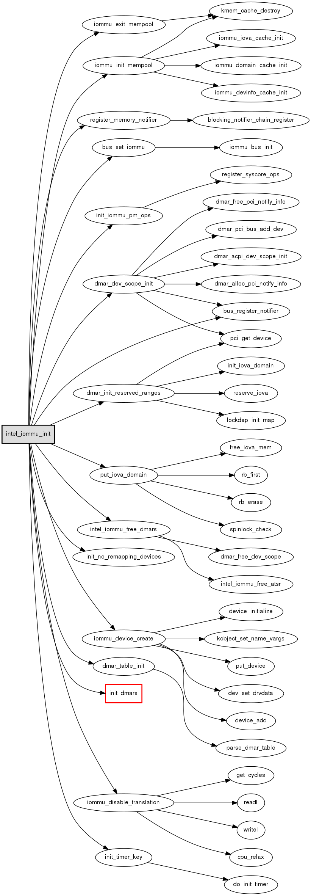

容器中使用CodeViz生成函数调用图。

<!--break-->


* 目录
{:toc}


## CodeViz介绍

CodeViz是一款分析C/C++源码中函数调用关系的工具，通过给GCC打补丁，编译时记录函数的调用关系，由Graphviz绘制图形。

最新的codeviz-1.0.12使用对gcc-4.6.2打补丁，步骤包括：
1. 下载codeviz
1. 下载相应版本的gcc
1. 下载gcc依赖的mpfr、gmp和mpc
1. 编译

下载编译过程比较耗时，已将编译好的环境封装成了docker镜像，方便使用。


1. 下载codeviz的docker镜像
```
$ sudo docker login daocloud.io
$ sudo docker pull  daocloud.io/dlworld/centos-codeviz
Using default tag: latest
```

1. 运行，将代码目录挂载到容器中
```
linux$ sudo docker run -it --name codeviz-linux -v $PWD/.:/app daocloud.io/dlworld/centos-codeviz "/bin/bash" 
[root@7a09dc78e3e9 /]# 
```

1. 编译目标代码
```
# yum install bc -y
# cd /app
# make menuconfig 
# make CC=/usr/local/gccgraph/bin/gcc -j4
```
编译过程中会生成.cdepn文件

1. 生成full.graph
```
# genfull
app]# ll -h full.graph 
-rw-r--r-- 1 root root 30M Feb  4 08:26 full.graph
```

1. 查看函数调用
```
app]# gengraph -k -t  -d 3 -f submit_bio
```

1. 修改中间文件重新生产图
```
app]# dot -Tpng -o submit_bio.png sub.graph
```

## gengraph常用参数

### 基本参数
-f, 顶层函数，如果多个使用引号
-o, 输出文件名，默认函数名
-d, 图的最大深度
-s, 显示函数，但不展开其调用
-g, genfull生成的源文件，默认./full.graph
-i, 忽略特定函数
-t, 忽略内核特定函数
-k, 保留中间（sub.graph）文件，该文件可以编辑，使用dot工具生成图
-r, 函数在底部，显示函数的被调用情况

### 正则表达式
-z, --func-re, 顶层函数 
-j, --ignore-re, 需要忽略的函数
-y, --show-re, 仅显示不展开的函数

### 输出格式参数
--output-type, 输出类型，包括ps、html、png和gif
--output-font/fontsize, 输出字体/大小，默认Helvetica，12
--output-layout, 页面样式，LR|RL|BT|TB，默认从上到下（TB）


## 示例


```
# gengraph -g full.graph -k -t -d 2 \
    -j "debug*;_raw_spin*;__builtin*;rcu_*" \
    -i "tboot_force_iommu;kzalloc;kfree" \
    -s "init_dmars"  \
    --output-layout LR --output-type png \
    -f intel_iommu_init
```




## 其它

### 命名冲突

大型项目中会有很多同名函数，genfull并不能区分它们，可以使用-s参数指定要检查的子目录。如：
```
genfull -s "mm include/linux drivers/block arch/i386"
```

### Daemon/Client模式

当full.graph很大时，

1. daemon方式运行
```
# gengraph -p -g ./full.graph
```

1. 生成函数调用图
```
# gengraph -q -t -d 2 -f alloc_pages
```

1. 终止gengraph运行
```
# echo QUIT > /tmp/codeviz.pipe
```


## 参考

http://www.cnblogs.com/lanxuezaipiao/p/3450201.html
http://blog.csdn.net/Solstice/article/details/486788
http://www.ibm.com/developerworks/cn/linux/l-graphvis/
http://www.gson.org/egypt/egypt.html
https://github.com/petersenna/codeviz

## 附录

### CodeViz的Dockerfile

```
FROM centos:7
MAINTAINER dlworld <denglinwen@gmail.com>
COPY install_gcc-4.6.2.sh /root/
RUN yum update -y && \
    yum install -y ftp wget bzip2 git which make graphviz gcc g++ patch perl-DB_File glib2-devel zlib-devel autoconf automake libtool ncurses-devel bc
RUN cd /root/ && wget ftp://ftp.gnu.org/pub/gnu/gcc/gcc-4.6.2/gcc-4.6.2.tar.bz2 && \
    md5sum gcc-4.6.2.tar.bz2 && tar xvf gcc-4.6.2.tar.bz2 && rm -rf gcc-4.6.2.tar.bz2 && \
    echo "Download gcc finished" && \
    cd gcc-4.6.2 && wget ftp://gcc.gnu.org/pub/gcc/infrastructure/mpfr-2.4.2.tar.bz2 ; \ 
    tar xvf mpfr-2.4.2.tar.bz2 && ln -sf mpfr-2.4.2 mpfr && rm -rf mpfr-2.4.2.tar.bz2 ; \ 
    wget ftp://gcc.gnu.org/pub/gcc/infrastructure/gmp-4.3.2.tar.bz2 ; \ 
    tar xvf gmp-4.3.2.tar.bz2 && ln -sf gmp-4.3.2 gmp && rm -rf gmp-4.3.2.tar.bz2 ; \ 
    wget ftp://gcc.gnu.org/pub/gcc/infrastructure/mpc-0.8.1.tar.gz ; \ 
    tar xvf mpc-0.8.1.tar.gz && ln -sf mpc-0.8.1 mpc && rm -rf mpc-0.8.1.tar.gz ; \ 
    cd /root/ && tar czvf gcc-4.6.2.tar.gz gcc-4.6.2 && rm -rf gcc-4.6.2
RUN cd /usr/include && ln -s x86_64-linux-gnu/* .; \
    cd /usr/lib && ln -s x86_64-linux-gnu/crt* .; \
    cd /root/ && git clone https://github.com/petersenna/codeviz.git && \
    mv gcc-4.6.2.tar.gz /root/codeviz/compilers/ &&\ 
    cd /root/ && cp /root/install_gcc-4.6.2.sh /root/codeviz/compilers/install_gcc-4.6.2.sh && \
    cd /root/codeviz/ && ./configure && make && make install && \
    rm -rf /root/codeviz && \
    yum clean all 
```


